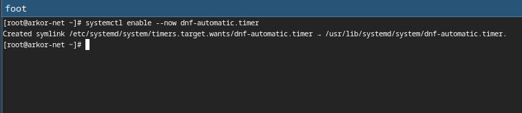

---
## Front matter
title: "Отчёт по лабораторной работе №1:"
subtitle: "Установка и конфигурация операционной системы на виртуальную машину"
author: "Коротков Андрей Романович"

## Bibliography
bibliography: bib/cite.bib
csl: pandoc/csl/gost-r-7-0-5-2008-numeric.csl

## Pdf output format
toc: true # Table of contents
toc-depth: 2
lof: true # List of figures
fontsize: 12pt
linestretch: 1.5
papersize: a4
documentclass: scrreprt

## I18n polyglossia
polyglossia-lang:
  name: russian
  options:
	- spelling=modern
	- babelshorthands=true
polyglossia-otherlangs:
  name: english

## I18n babel
babel-lang: russian
babel-otherlangs: english

## Fonts
mainfont: PT Mono
romanfont: PT Mono
sansfont: PT Mono
monofont: PT Mono
mainfontoptions: Ligatures=TeX
romanfontoptions: Ligatures=TeX
sansfontoptions: Ligatures=TeX,Scale=MatchLowercase
monofontoptions: Scale=MatchLowercase,Scale=0.9

## Biblatex
biblatex: true
biblio-style: "gost-numeric"
biblatexoptions:
  - parentracker=true
  - backend=biber
  - hyperref=auto
  - language=auto
  - autolang=other*
  - citestyle=gost-numeric

## Pandoc-crossref LaTeX customization
figureTitle: "Рис."
tableTitle: "Таблица"
lofTitle: "Список иллюстраций"

## Misc options
indent: true
header-includes:
  - \usepackage[russian]{babel}
  - \usepackage[utf8]{inputenc}
  - \usepackage{indentfirst}
  - \usepackage{float} # keep figures where there are in the text
  - \floatplacement{figure}{H} # keep figures where there are in the text
---

# Цель работы
Целью данной работы является приобретение практических навыков установки операционной системы на виртуальную машину, настройки минимально необходимых для дальнейшей работы сервисов.

# Задания
1. Создать виртуальную машину;
2. Установить операционную систему;
3. Настройка после установки системы:
  - Первоначальная настройка
  - Установка драйверов для VirtualBox
  - Настройка раскладки клавиатуры
  - Установка имени пользователя и названия хоста
  - Подключение общей папки
  - Установка программного обеспечения для создания документации
  
# Выполнение лабораторной работы
### Задание 1 
Используя графический интерфейс создаём новую виртуальную машину. 
- В качестве имени укажем логин в дисплейных классах **arkorotkov**
- В качестве образа выберем скаченный ранее файл .iso - Linux Fedora(sway)
- Размер основной памяти виртуальной машины — 4096 МБ
- Включим поддержку UEFI
- Конфигурацию жёсткого диска — загрузочный, динамический виртуальный диск, размер диска — 80 ГБ

{#fig:001 width=100%}

Используя графический интерфейс настроим созданную виртуальную машину:
- В качестве графического котроллера выберем **VMSGA** и включим **3D ускорение**

{#fig:002 width=100%}

- Включим двунаправленный общий буфер обмена между хостом и гостевой ОС

{#fig:003 width=100%}

- Привод оптических дисков уже добавлен вместе с необходимым образом

{#fig:004 width=100%}

### Задание 2
Запускаем виртуальную машину, выбираем ОС **Fedora-Sway-Live** и нажимаем *Enter*

{#fig:005 width=100%}

Нажимаем комбинацию клавиш *Win+Enter* и вводим в терминал команду **liveinst**

{#fig:006 width=100%}

Выбираем язык интерфейса и переходим к настройке установки ОС:
- Место установки ОС оставляем без изменения
- Устанавливаем имя и пароль для пользователя **root**
- Устанавливаем имя и пароль для собственного пользователя
- Зададим сетевое имя компьютера

{#fig:007 width=100%}

После завершения установки нужно перезагрузить виртуальную машину отключив оптический диск с образом, если этого не произошло автоматически.

### Задание 3
#### Первоначальная настройка
Авторизуемся в ОС используя данные учётной записи при установке. Запускаем терминал используя комбинацию клавиш *Win+Enter*:
- Переключаемся на роль супер-пользователя командой **sudo -i**

{#fig:008 width=100%}

- Обновляем все пакеты командой **dnf -y update**

{#fig:009 width=100%}

- Устанавливаем программы для удобства работы в консоли командой **dnf -y install tmux mc**

{#fig:010 width=100%}

- Устанавливаем программное обеспечение для автоматического обновления командой **dnf install dnf-automatic**

{#fig:011 width=100%}

- Настраиваем программное обеспечение для автоматического обновления

{#fig:012 width=100%}

Отключаем SELinux изменив значение SELINUX в файле **/etc/selinux/config**

{#fig:013 width=100%}

Перезагружаем виртуальную машину командой **reboot**

#### Установка драйверов для VirtualBox
Авторизуемся в ОС используя данные учётной записи при установке. Запускаем терминал используя комбинацию клавиш *Win+Enter*:
- Запускаем терминальный мультиплексор командой **tmux**
- Переключаемся на роль супер-пользователя
- Установливем средства разработки командой **dnf -y group install "Development Tools"**

{#fig:014 width=100%}

- Установливаем пакет DKMS командой **dnf -y install dkms**

{#fig:015 width=100%}

- В меню виртуальной машины подключаем образ диска дополнений гостевой ОС. Подмонтируем диск командой **mount /dev/sr0 /media** и установим драйвера командой **/media/VBoxLinuxAdditions.run**

{#fig:016 width=100%}

Перезагружаем виртуальную машину командой **reboot**

#### Настройка раскладки клавиатуры
Авторизуемся в ОС используя данные учётной записи при установке. Запускаем терминал используя комбинацию клавиш *Win+Enter*:
- Запускаем терминальный мультиплексор командой **tmux**
- Переключаемся на роль супер-пользователя
- Редактируем конфигурационный файл /etc/X11/xorg.conf.d/00-keyboard.conf используя файловый менеджер mc и его встроенный редактор

{#fig:017 width=100%}

Перезагружаем виртуальную машину командой **reboot**

#### Установка имени пользователя и названия хоста
Авторизуемся в ОС используя данные учётной записи при установке. Запускаем терминал используя комбинацию клавиш *Win+Enter*:
- Запускаем терминальный мультиплексор командой **tmux**
- Переключаемся на роль супер-пользователя
- Создание нового пользователя командой **adduser -G wheel имя** и установка пароля командой **passwd имя**

{#fig:018 width=100%}

- Установка имени хоста командой **hostnamectl set-hostname имя** и проверка командой **hostnamectl**

{#fig:019 width=100%}

#### Подключение общей папки
Добавление пользователя в группу vboxsf командой **gpasswd -a имя vboxsf**

{#fig:020 width=100%}

Подключене в хостовой системе разделяемую папку с помощью графического интерфейса

{#fig:021 width=100%}

Перезагружаем виртуальную машину командой **reboot**

#### Установка программного обеспечения для создания документации
- Скачиваем необходимую версию **pandoc-crossref** и соответствующую версию **pandoc**. Закидываем скаченные файлы в разделяемую папку хостовой системы.
- Переносим архивы из монтированной папки в каталог **/usr/local/bin**

{#fig:022 width=100%}

- Распаковать архивы в каталоге

{#fig:023 width=100%}

- Установка дистрибутива **TeXlive** командой **dnf -y install texlive-scheme-full**

{#fig:024 width=100%}

# Выводы

В ходе данной лабороторной работы я приобрел практические навыки установки операционной системы на виртуальную машину и настройки минимально необходимых для дальнейшей работы сервисов.

# Ответы на контрольные вопросы
1.Учётная запись пользователя содержит следующую информацию:

- Имя пользователя (Username)
- Пароль (Password)
- Идентификатор пользователя (UID, User ID)
- Идентификатор группы (GID, Group ID)
- Группы (Groups)
- Домашний каталог (Home directory)
- Оболочка (Shell)
- Дополнительная информация (GECOS)

2.Команды и примеры в указаном порядке:

- Команда **man**, пример **man ls**
- Команда **cd**, пример **cd /home/user**
- Команда **ls**, пример **ls -h**
- Команда **du**, пример **du -h /home**
- Команда **mkdir**, пример **mkdir new_directory**
- Команда **rm**, пример **rm -r non_empty_directory**
- Команда **touch**, пример **touch new_file.txt**
- Команда **chmod**, пример **chmod 644 document.txt**
- Команда **history**, пример **history | grep ls**

3.Файловая система — это структура и логика, по которой операционная система организует, управляет и хранит данные на носителях информации. Файловая система определяет, как данные хранятся и извлекаются. Несколько примеров:

- NTFS (New Technology File System)
  - Основная файловая система для Windows. Поддерживает большие файлы и тома, а также предоставляет средства для безопасности и восстановление данных.
- FAT32 (File Allocation Table 32)
  - Старый, но широко совместимый файловая система, используемая на съемных носителях.

4.Существует несколько способов, один из них команда **df**
5.Для начала нужно узнать имя или PID процесса с найдя процесс в списке командой **top**. Затем удалить указав имя командой **kill** или указав PID командой **pkill**

# Отчёт о выполнении дополнительного задания
Информация о версии ядра Linux, частоте процессора, модели процессора, объёме доступной оперативной памяти, типе обнаруженного гипервизора:

{#fig:025 width=100%}

Тип файловой системы корневого раздела:

{#fig:026 width=100%}

Последовательность монтирования файловых систем:

{#fig:027 width=100%}