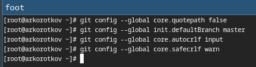
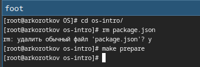

---
## Front matter
title: "Отчёт по лабораторной работе №2:"
subtitle: "Первоначальна настройка git"
author: "Коротков Андрей Романович"

## Bibliography
bibliography: bib/cite.bib
csl: pandoc/csl/gost-r-7-0-5-2008-numeric.csl

## Pdf output format
toc: true # Table of contents
toc-depth: 2
lof: true # List of figures
lot: true # List of tables
fontsize: 12pt
linestretch: 1.5
papersize: a4
documentclass: scrreprt

## I18n polyglossia
polyglossia-lang:
  name: russian
  options:
	- spelling=modern
	- babelshorthands=true
polyglossia-otherlangs:
  name: english

## I18n babel
babel-lang: russian
babel-otherlangs: english

## Fonts
mainfont: PT Serif
romanfont: PT Serif
sansfont: PT Sans
monofont: PT Mono
mainfontoptions: Ligatures=TeX
romanfontoptions: Ligatures=TeX
sansfontoptions: Ligatures=TeX,Scale=MatchLowercase
monofontoptions: Scale=MatchLowercase,Scale=0.9

## Biblatex
biblatex: true
biblio-style: "gost-numeric"
biblatexoptions:
  - parentracker=true
  - backend=biber
  - hyperref=auto
  - language=auto
  - autolang=other*
  - citestyle=gost-numeric

## Pandoc-crossref LaTeX customization
figureTitle: "Рис."
listingTitle: "Листинг"
lofTitle: "Список иллюстраций"
lolTitle: "Листинги"

## Misc options
indent: true
header-includes:
  - \usepackage[russian]{babel}
  - \usepackage[utf8]{inputenc}
  - \usepackage{indentfirst}
  - \usepackage{float} # keep figures where there are in the text
  - \floatplacement{figure}{H} # keep figures where there are in the text
---

# Цель работы
Изучить идеологию и применение средств контроля версий. Освоить умения по работе с git.

# Задания
1. Создать базовую конфигурацию для работы с git.
2. Создать ключи SSH и PGP.
3. Настроить подписи git.
4. Создать локальный каталог для выполнения заданий по предмету.
  
# Выполнение лабораторной работы
### Задание 1 
Для начала установим программное обеспечение коммандами **dnf install git** и **dnf install gh**

{#fig:001 width=100%}

Проведём базовую настройку:

- Зададим имя и email владельца репозитория командами **git config --global user.name "Name Surname"** и **git config --global user.email "work@mail"**

{#fig:002 width=100%}

- Настроим **utf-8** в выводе сообщений git командой **git config --global core.quotepath false**
- Зададим имя начальной ветки командой **git config --global init.defaultBranch master**
- Настроим параметр **autocrlf** командой **git config --global core.autocrlf input**
- Настроим параметр **safecrlf** командой **git config --global core.safecrlf warn**

{#fig:003 width=100%}

### Задание 2
Создадим ключ *ssh* о алгоритму *rsa* с размером 4096 бит командой **ssh-keygen -t rsa -b 4096**.

{#fig:004 width=100%}

Создадим ключ *ssh* о алгоритму *ed25519* командой **ssh-keygen -t ed25519**

{#fig:005 width=100%}

Создадим ключ *pgp* командой **gpg --full-generate-key**. Из предложенных опций выбираем:

- тип *RSA* and *RSA*;
- размер 4096;
- выбаем срок действия;

Вводим личную кинформацию и комментарий.

{#fig:006 width=100%}

### Задание 3
#### Добавление PGP ключа в GitHub
Копируем приватный ключ в файл командой **gpg --armor --export почта_владельца > /файл.txt**

{#fig:007 width=100%}

Переходим на https://github.com/settings/keys и добавляем полученный ключ.

{#fig:008 width=100%}

#### Настройка автоматических подписей коммитов git
Используя введёный email, укажим Git применять его при подписи коммитов используя команды:

- **git config --global user.signingkey <PGP Fingerprint>**
- **git config --global commit.gpgsign true**
- **git config --global gpg.program $(which gpg2)**

{#fig:009 width=100%}

#### Настройка gh
Авторизация командой **gh auth login**

{#fig:010 width=100%}

### Задание 4

- Создадим каталог для репозитория командой **mkdir -p ~/study/2024/OS**
- Перейдём в созданный каталог командой **cd ~/study/2024/OS**
- Создадим репозиторий на основе шаблона командой **gh repo create study_2024_os-intro --template=yamadharma/course-directory-student-template --public**
- Клонируем созданный репозиторий в каталог командой **git clone --recursive git@github.com:korotandr/study_2024_os-intro.git os-intro**

{#fig:011 width=100%}

Настройка каталога курса:

- Перейти в каталог курса командой **cd os-intro**
- Удалить лишние файлы командой **rm package.json**
- Создать необходимые каталоги командой **make prepare**

{#fig:012 width=100%}

Отправка файлов на сервер последовательностью команд:

- **git add .**
- **git commit -am 'feat(main): make course structure'**
- **git push**

{#fig:013 width=100%}

# Выводы

В ходе данной лабораторной работы я смог изучить идеологию и применение средств контроля версий, а так же освоил основные аспекты работы с git.

# Ответы на контрольные вопросы
1.Системы контроля версий (Version Control Systems, VCS) — это программные инструменты, предназначенные для управления изменениями в исходном коде, документации и других данных в процессе разработки. Основные задачи:

- Отслеживание изменений
- Совместная работа
- Управление версиями
- Восстановление версий
- Резервное копирование и восстановление

2.Хранилище:
Это центральное место, где сохраняется вся история изменений проекта, включая все версии файлов, метаданные изменений (например, авторы и временные метки), и другие данные, необходимые для управления версиями.

Commit:
Это операция, при которой изменения, внесённые в файлы рабочей копии, сохраняются в хранилище как отдельная версия (коммит).

История:
Это последовательность всех коммитов, сохранённых в хранилище.

Рабочая копия:
Это текущая версия файлов проекта на локальной машине разработчика, с которой он непосредственно работает.

Взаимосвязь этих понятий:

- Разработчик клонирует или извлекает репозиторий, создавая рабочую копию на своём компьютере.
- В рабочей копии он вносит изменения в файлы проекта.
- После завершения работы он фиксирует (commit) изменения, добавляя новый коммит в историю репозитория.
- Хранилище обновляется, и новая версия проекта становится доступной для других участников команды.
- История изменений позволяет отслеживать все внесённые изменения и при необходимости откатываться к предыдущим версиям.

3.Централизованные системы контроля версий (CVCS)

- Единое хранилище
- Обмен данными через сервер
- Простота администрирования
- Примеры:
  - CVS (Concurrent Versions System)
  - Subversion (SVN)

Децентрализованные системы контроля версий (DVCS)

- Полные копии репозитория
- Работа офлайн
- Масштабируемость и гибкость
- Примеры:
  - Git
  - Mercurial

4.Примерный процесс работы:

- Инициализация или клонирование репозитория
- Работа с файлами
- Отслеживание изменений
- Коммит изменений
- Синхронизация
- Просмотр истории

5.Примерный процесс работы в команде:

- Клонирование репозитория
- Обновление перед началом работы
- Работа с файлами и коммиты
- Регулярная синхронизация
- Разрешение конфликтов
- Push изменений
- Просмотр истории и анализ

6.Основные задачи, решаемые инструментальным средством **git**:

- Отслеживание изменений
- Управление версиями
- Совместная работа
- Создание и управление ветками
- Объединение изменений (Merge)
- Разрешение конфликтов
- История изменений
- Обеспечение целостности данных
- Резервное копирование и восстановление
- Работа офлайн
- Интеграция с CI/CD

7.**git init** — создание нового репозитория в текущей директории.

**git clone URL** — клонирование удалённого репозитория на локальную машину.

**git add file** — добавление файла в коммит.

**git commit -m "Сообщение"** — создание коммита с описанием изменений.

**git branch branch-name** — создание новой ветки.

**git checkout branch-name** — переключение на другую ветку.

**git merge branch-name** — объединение изменений из указанной ветки в текущую.

**git push origin branch-name** — отправка локальных изменений в удалённый репозиторий.

**git pull origin branch-name** — извлечение изменений из удалённого репозитория и объединение их с локальными.

**git log** — просмотр истории коммитов.

**git fetch** — синхронизация с удалённым репозиторием

8.Работа с локальным репозиторием:

- git init
- git add file1.txt file2.txt
- git commit -m "Initial commit"
- git status
- git log
- git branch new-feature
- git checkout new-feature
- git checkout master
- git merge new-feature
- Разрешение конфликтов

Работа с удалённым репозиторием:

- git clone https://github.com/user/repository.git
- git remote add origin https://github.com/user/repository.git
- git push origin master
- git pull origin master
- git remote -v
- git checkout -b new-feature
- git push origin new-feature
- git push origin --delete new-feature
- git fetch

9.Ветви (branches) в системах контроля версий, являются важным инструментом для управления разработкой проекта. Они позволяют разработчикам работать над различными задачами, функциями или исправлениями независимо друг от друга.

10.Игнорирование некоторых файлов при commit в системах контроля версий позволяет исключить из репозитория временные, сгенерированные или конфиденциальные файлы, которые не должны быть частью версионного контроля. Для этого в Git используется специальный файл .gitignore.