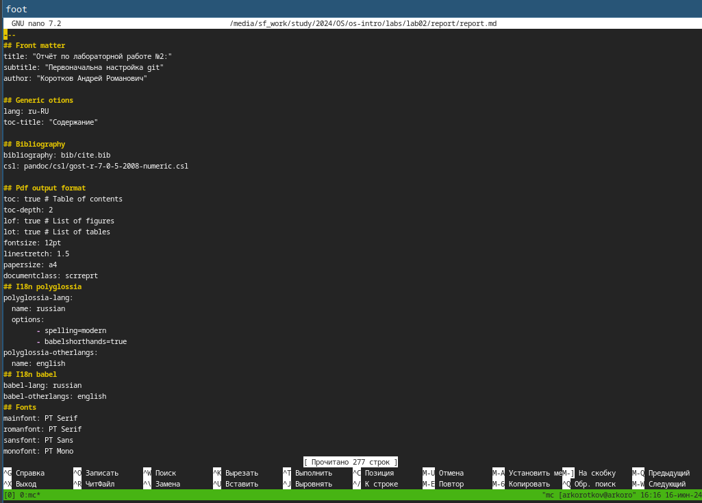
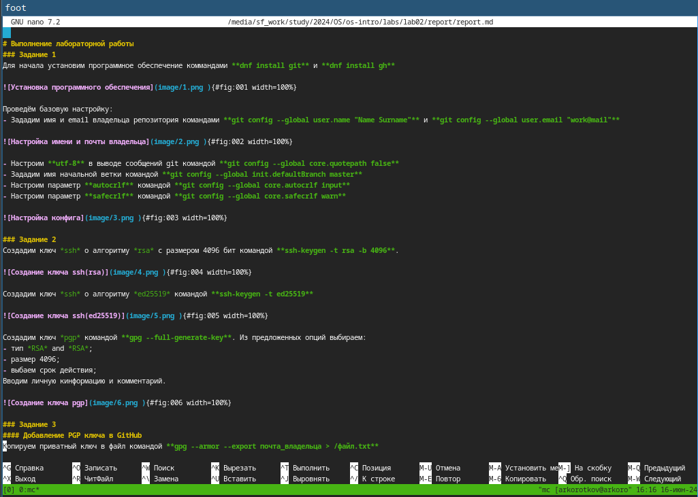
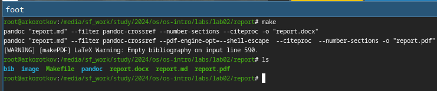
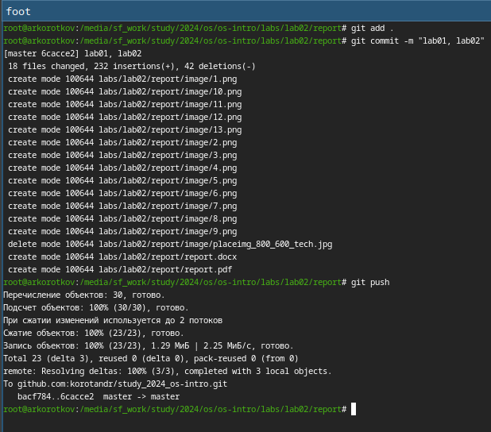

---
## Front matter
title: "Отчёт по лабораторной работе №3:"
subtitle: "Markdown"
author: "Коротков Андрей Романович"

## Bibliography
bibliography: bib/cite.bib
csl: pandoc/csl/gost-r-7-0-5-2008-numeric.csl

## Pdf output format
toc: true # Table of contents
toc-depth: 2
lof: true # List of figures
fontsize: 12pt
linestretch: 1.5
papersize: a4
documentclass: scrreprt

## I18n polyglossia
polyglossia-lang:
  name: russian
  options:
	- spelling=modern
	- babelshorthands=true
polyglossia-otherlangs:
  name: english

## I18n babel
babel-lang: russian
babel-otherlangs: english

## Fonts
mainfont: PT Mono
romanfont: PT Mono
sansfont: PT Mono
monofont: PT Mono
mainfontoptions: Ligatures=TeX
romanfontoptions: Ligatures=TeX
sansfontoptions: Ligatures=TeX,Scale=MatchLowercase
monofontoptions: Scale=MatchLowercase,Scale=0.9

## Biblatex
biblatex: true
biblio-style: "gost-numeric"
biblatexoptions:
  - parentracker=true
  - backend=biber
  - hyperref=auto
  - language=auto
  - autolang=other*
  - citestyle=gost-numeric

## Pandoc-crossref LaTeX customization
figureTitle: "Рис."
listingTitle: "Листинг"
lofTitle: "Список иллюстраций"
lolTitle: "Листинги"

## Misc options
indent: true
header-includes:
  - \usepackage[russian]{babel}
  - \usepackage[utf8]{inputenc}
  - \usepackage{indentfirst}
  - \usepackage{float} # keep figures where there are in the text
  - \floatplacement{figure}{H} # keep figures where there are in the text
---

# Цель работы
Научиться оформлять отчёты с помощью языка разметки Markdown.

# Задание
1. Ознакомиться с синтаксисом языка разметки Markdown;
2. Узнать, как компилируются отчёты в различных форматах из исходного файла с расширением .md;
3. Создать отчёт по предыдущей лабораторной работе в формате Markdown

# Выполнение лабораторной работы
Для начала перейдем в каталог с лабораторной работой №2 командой **cd ~/study/2024/OS/os-intro/labs/lab02/report**, затем используя любое средство работы с текстовыми файлами отредактируем файл с отчётом. Вносим изменения в шаблон, заполнив своими данными: ФИО, номер ЛР, название ЛР. И приступаем составлению отчета по выполненным в ходе ЛР действий и их описанию, используя базовые сведения из теоритической части ЛР №3.

{#fig:001 width=100%}

{#fig:002 width=100%}

После завершения оформления отчета необходимо скомпилировать его с помощью команды **make** (в папке с ЛР есть Makefile, который сам скомпилирует, поэтому вручную писать нет необходимости). Командой **ls** проверяем, появились ли файлы.

{#fig:003 width=100%}

Затем отправляем полученные файлы на GitHub посредством локального репозитория.

{#fig:004 width=100%}

# Выводы
В данной лабораторной работе я научился оформлять отчёты с помощью языка разметки Markdown.