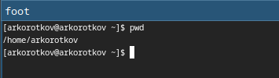
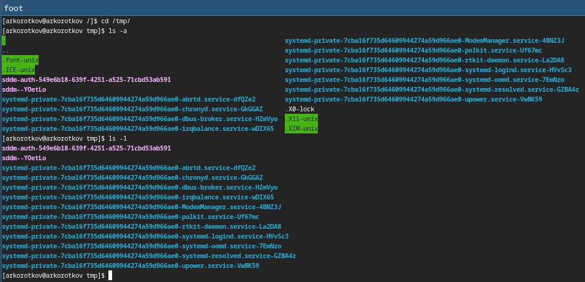
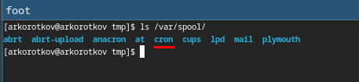
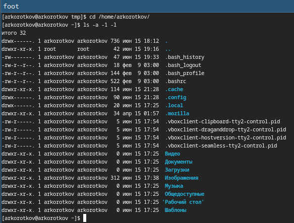
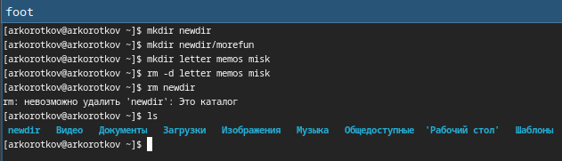
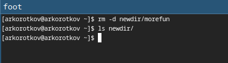
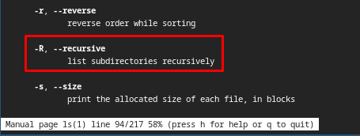
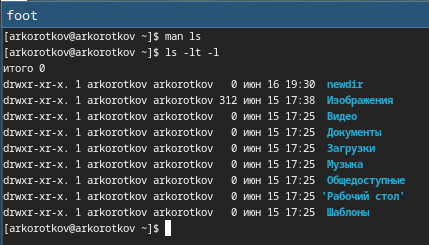
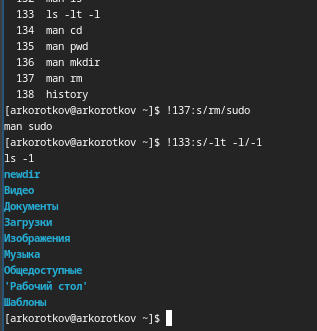

---
## Front matter
title: "Отчёт по лабораторной работе №4:"
subtitle: "Основы интерфейса взаимодействия пользователя с системой Unix на уровне командной строки"
author: "Коротков Андрей Романович"

## Bibliography
bibliography: bib/cite.bib
csl: pandoc/csl/gost-r-7-0-5-2008-numeric.csl

## Pdf output format
toc: true # Table of contents
toc-depth: 2
lof: true # List of figures
fontsize: 12pt
linestretch: 1.5
papersize: a4
documentclass: scrreprt

## I18n polyglossia
polyglossia-lang:
  name: russian
  options:
	- spelling=modern
	- babelshorthands=true
polyglossia-otherlangs:
  name: english

## I18n babel
babel-lang: russian
babel-otherlangs: english

## Fonts
mainfont: PT Mono
romanfont: PT Mono
sansfont: PT Mono
monofont: PT Mono
mainfontoptions: Ligatures=TeX
romanfontoptions: Ligatures=TeX
sansfontoptions: Ligatures=TeX,Scale=MatchLowercase
monofontoptions: Scale=MatchLowercase,Scale=0.9

## Biblatex
biblatex: true
biblio-style: "gost-numeric"
biblatexoptions:
  - parentracker=true
  - backend=biber
  - hyperref=auto
  - language=auto
  - autolang=other*
  - citestyle=gost-numeric

## Pandoc-crossref LaTeX customization
figureTitle: "Рис."
listingTitle: "Листинг"
lofTitle: "Список иллюстраций"
lolTitle: "Листинги"

## Misc options
indent: true
header-includes:
  - \usepackage[russian]{babel}
  - \usepackage[utf8]{inputenc}
  - \usepackage{indentfirst}
  - \usepackage{float} # keep figures where there are in the text
  - \floatplacement{figure}{H} # keep figures where there are in the text
---

# Цель работы
Приобретение практических навыков взаимодействия пользователя с системой посредством командной строки.

# Задание
1. Определить полное имя вашего домашнего каталога.
2. Выполнить следующие действия:
    1. Перейти в каталог /tmp.
    2. Вывести на экран содержимое каталога /tmp. Использовать команду ls
  с различными опциями. Пояснить разницу в выводимой на экран информации.
    3. Определить, есть ли в каталоге /var/spool подкаталог с именем cron.
    4. Перейти в домашний каталог и вывести на экран его содержимое. Определить, кто является владельцем файлов и подкаталогов.
3. Выполнить следующие действия:
    1. В домашнем каталоге создать новый каталог с именем newdir.
    2. В каталоге ~/newdir создать новый каталог с именем morefun.
    3. В домашнем каталоге создать одной командой три новых каталога с именами
  letters, memos, misk. Затем удалить эти каталоги одной командой.
    4. Попробовать удалить ранее созданный каталог ~/newdir командой rm. Проверить,
  был ли каталог удалён.
    5. Удалить каталог ~/newdir/morefun из домашнего каталога. Проверить, был ли
каталог удалён
4. С помощью команды man определить, какую опцию команды ls нужно использовать для просмотра содержимого не только указанного каталога, но и подкаталогов, входящих в него.
5. С помощью команды man определить набор опций команды ls, позволяющий отсортировать по времени последнего изменения выводимый список содержимого каталога с развёрнутым описанием файлов.
6. Используйте команду man для просмотра описания следующих команд: cd, pwd, mkdir,
rmdir, rm. Пояснить основные опции этих команд.
7. Используя информацию, полученную при помощи команды history, выполнить модификацию и исполнение нескольких команд из буфера команд.

# Выполнение лабораторной работы
### Задание 1
Используем команду **pwd**

{#fig:001 width=100%}

### Задание 2
Переходим в каталог /tmp командой **cd /tmp**. Выполняем команду ls с различиными опциями:

- **ls -a** - список включает скрытые файлы
- **ls -1** - каждый файл занимет одну строку

{#fig:002 width=100%}

Выполнение команды **ls /var/spool** с целью проверки наличия католога **cron**

{#fig:003 width=100%}

Переходим в домашний каталог пользователя командой **cd /home/arkorotkov**. Используем команду **ls -a -l -1** для получения информации о владельцах файлов и подкаталогов.

{#fig:004 width=100%}

### Задание 3
- Создаём каталог командой **mkdir newdir**
- Создаём подкаталог командой **mkdir newdir/morefun**
- Создаём несколько каталогов одной командой **mkdir letter memos misk**
- Удаляем каталоги одной командой **rm -d letter memos misk**
- Пробуем удалить каталог **newdir** командой **rm newdir**
- Смотрим результат удаления

{#fig:005 width=100%}

- Удаляем подкаталог morefun командой **rm newdir/morefun**
- Проверяем результат удаления командой **ls newdir**

{#fig:006 width=100%}

### Задание 4
Воспользовавшись командой **man ls** мы узнали что есть опция **-R** позволяющая видеть содержимое каталога вместе с содержимым его подкаталогов.

{#fig:007 width=100%}

### Задание 5
Воспользовавшись командой **man ls** мы выяснили, что для сортировки по времени изменения и вывода подробной информации нужно применить команду **ls -lt -l**.

{#fig:008 width=100%}

### Задание 6
Несколько примеров возможных опций следующих команд:

Опции **cd**:
**..**: Перемещение на один уровень вверх в файловой системе.
**~**: Перемещение в домашнюю директорию текущего пользователя.
**-**: Перемещение в предыдущую директорию.

Опции **pwd**:
**-L**: Выводит логический путь, содержащий ссылки (по умолчанию).
**-P**: Выводит физический путь, без ссылок (canonical).

Опции **mkdir**:
**-p**: Рекурсивное создание директорий, если промежуточные директории не существуют.
**-v**: Вывод информации о создании каждой директории (verbose).

Опции **rmdir**:
**-p**: Рекурсивное удаление директории и её пустых родительских директорий.

Опции **rm**:
**-r**: Рекурсивное удаление директории и всех её содержимых файлов и поддиректорий.
**-f**: Принудительное удаление файла без запроса подтверждения.
**-i**: Запрос подтверждения перед удалением каждого файла.
**-v**: Вывод информации о каждом удаляемом файле (verbose).

### Задание 7
Воспользовавшись командой **history** имзеним несколько команд использовав конструкцию **!номер:s/старое/новое**

{#fig:009 width=100%}

# Выводы
В ходе данной лабораторной работы я приобрел практические навыки взаимодействия пользователя с системой посредством командной строки.

# Ответы на контрольные вопросы
1.Командная строка — это текстовый интерфейс пользователя, через который можно взаимодействовать с операционной системой.

2.При помощи команды **pwd**.

3.При помощи команды **ls -F**.

4.При помощи команды **ls -a**.

5.При помощи команды **rm**. Примеры:

- **rm filename.txt**
- **rm -r directory_name**

6.При помощи команды **history**.

7.Примеры:

- Повторение последней команды **!!**
- Выполнение команды с номером 42 **!42**
- Замена части последней команды и её выполнение **!!:s/old/new**

8.Пример: **cd /path/to/directory; ls -l; pwd**

9.Символы экранирования используются для представления специальных символов как обычных текстовых символов. Пример:

- **echo 'Hello, $USER'**

10.Опция **-l** для команды **ls** выводит детальную информацию о файлах в формате списка.

11.Относительный путь — путь относительно текущего каталога.

- **cd subdirectory**

Абсолютный путь — полный путь от корневого каталога.

- cd /home/user/subdirectory

12.Для получения информации о команде используется команда **man** или опция **--help**.

13.Для автоматического дополнения вводимых команд используется клавиша *Tab*.