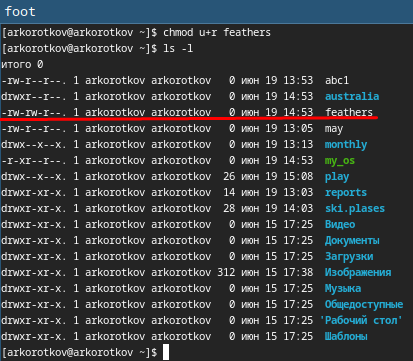

---
## Front matter
title: "Отчёта по лабораторной работе №5:"
subtitle: "Анализ файловой системы Linux. Команды для работы с файлами и каталогами"
author: "Коротков Андрей Романович"

## Bibliography
bibliography: bib/cite.bib
csl: pandoc/csl/gost-r-7-0-5-2008-numeric.csl

## Pdf output format
toc: true # Table of contents
toc-depth: 2
lof: true # List of figures
fontsize: 12pt
linestretch: 1.5
papersize: a4
documentclass: scrreprt

## I18n polyglossia
polyglossia-lang:
  name: russian
  options:
	- spelling=modern
	- babelshorthands=true
polyglossia-otherlangs:
  name: english

## I18n babel
babel-lang: russian
babel-otherlangs: english

## Fonts
mainfont: PT Mono
romanfont: PT Mono
sansfont: PT Mono
monofont: PT Mono
mainfontoptions: Ligatures=TeX
romanfontoptions: Ligatures=TeX
sansfontoptions: Ligatures=TeX,Scale=MatchLowercase
monofontoptions: Scale=MatchLowercase,Scale=0.9

## Biblatex
biblatex: true
biblio-style: "gost-numeric"
biblatexoptions:
  - parentracker=true
  - backend=biber
  - hyperref=auto
  - language=auto
  - autolang=other*
  - citestyle=gost-numeric

## Pandoc-crossref LaTeX customization
figureTitle: "Рис."
listingTitle: "Листинг"
lofTitle: "Список иллюстраций"
lolTitle: "Листинги"

## Misc options
indent: true
header-includes:
  - \usepackage[russian]{babel}
  - \usepackage[utf8]{inputenc}
  - \usepackage{indentfirst}
  - \usepackage{float} # keep figures where there are in the text
  - \floatplacement{figure}{H} # keep figures where there are in the text
---

# Цель работы
Ознакомление с файловой системой Linux, её структурой, именами и содержанием каталогов. Приобретение практических навыков по применению команд для работы с файлами и каталогами, по управлению процессами (и работами), по проверке использования диска и обслуживанию файловой системы.

# Задание
1. Выполнить все примеры, приведённые в первой части описания лабораторной работы.
2. Выполнить следующие действия, зафиксировав в отчёте по лабораторной работе используемые при этом команды и результаты их выполнения:
    1. Скопировать файл /usr/include/sys/io.h в домашний каталог и назвать его equipment. Если файла io.h нет, то использовать любой другой файл в каталоге /usr/include/sys/ вместо него.
    2. В домашнем каталоге создать директорию ~/ski.plases.
    3. Переместить файл equipment в каталог ~/ski.plases.
    4. Переименовать файл ~/ski.plases/equipment в ~/ski.plases/equiplist.
    5. Создать в домашнем каталоге файл abc1 и скопировать его в каталог ~/ski.plases, назвать его equiplist2.
    6. Создать каталог с именем equipment в каталоге ~/ski.plases.
    7. Переместить файлы ~/ski.plases/equiplist и equiplist2 в каталог ~/ski.plases/equipment.
    8. Создать и переместить каталог ~/newdir в каталог ~/ski.plases и назвать его plans.
3. Определить опции команды chmod, необходимые для того, чтобы присвоить перечисленным ниже файлам выделенные права доступа, считая, что в начале таких прав нет:
    1. drwxr--r-- ... australia
    2. drwx--x--x ... play
    3. -r-xr--r-- ... my_os
    4. -rw-rw-r-- ... feathers 
    При необходимости создать нужные файлы.
4. Проделать приведённые ниже упражнения, записывая в отчёт по лабораторной работе используемые при этом команды:
    1. Просмотреть содержимое файла /etc/password.
    2. Скопировать файл ~/feathers в файл ~/file.old.
    3. Переместить файл ~/file.old в каталог ~/play.
    4. Скопировать каталог ~/play в каталог ~/fun.
    5. Переместить каталог ~/fun в каталог ~/play и назвать его games.
    6. Лишить владельца файла ~/feathers права на чтение.
    7. Что произойдёт, если попытаться просмотреть файл ~/feathers командой cat?
    8. Что произойдёт, если попытаться скопировать файл ~/feathers?
    9. Дать владельцу файла ~/feathers право на чтение.
    10. Лишить владельца каталога ~/play права на выполнение.
    11. Перейти в каталог ~/play. Что произошло?
    12. Дать владельцу каталога ~/play право на выполнение.
5. Прочитать man по командам mount, fsck, mkfs, kill и кратко их охарактеризовать,
приведя примеры.

# Выполнение лабораторной работы

### Задание 1

#### Копирование файлов и каталогов
1.Копирование файла в текущем каталоге. Скопировать файл ~/abc1 в файл april и в файл may:

{#fig:001 width=100%}

2.Копирование нескольких файлов в каталог. Скопировать файлы april и may в каталог monthly:

{#fig:002 width=100%}

3.Копирование файлов в произвольном каталоге.Скопировать файл monthly/may в файл с именем june:

{#fig:003 width=100%}

Рекурсивное копирование.
1.Копирование каталогов в текущем каталоге. Скопировать каталог monthly в каталог monthly.00:

{#fig:004 width=100%}

2.Копирование каталогов в произвольном каталоге. Скопировать каталог monthly.00 в каталог /tmp

{#fig:005 width=100%}

#### Перемещение и переименование файлов и каталогов
1.Переименование файлов в текущем каталоге. Изменить название файла april на july в домашнем каталоге:

{#fig:006 width=100%}

2.Перемещение файлов в другой каталог. Переместить файл july в каталог monthly.00:

{#fig:007 width=100%}

3.Переименование каталогов в текущем каталоге. Переименовать каталог monthly.00 в monthly.01

{#fig:008 width=100%}

4.Перемещение каталога в другой каталог. Переместить каталог monthly.01 в каталог reports:

{#fig:009 width=100%}

5.Переименование каталога, не являющегося текущим. Переименовать каталог reports/monthly.01 в reports/monthly:

{#fig:010 width=100%}

#### Изменение прав доступа
1.Требуется создать файл ~/may с правом выполнения для владельца:

{#fig:011 width=100%}

2.Требуется лишить владельца файла ~/may права на выполнение:

{#fig:012 width=100%}

3.Требуется создать каталог monthly с запретом на чтение для членов группы и всех остальных пользователей:

{#fig:013 width=100%}

4.Требуется создать файл ~/abc1 с правом записи для членов группы:

{#fig:014 width=100%}

#### Анализ файловой системы
С помощью команды **fsck** можно проверить (а в ряде случаев восстановить) целостность файловой системы:

{#fig:015 width=100%}

### Задание 2
1.Скопировать файл /usr/include/sys/io.h в домашний каталог и назвать его equipment командой **cp /usr/include/sys/io.h equipment**

{#fig:016 width=100%}

2.В домашнем каталоге создать директорию ~/ski.plases командой **mkdir ski.plases**

{#fig:017 width=100%}

3.Переместить файл equipment в каталог ~/ski.plases командой **mv equipment ~/ski.plases**

{#fig:018 width=100%}

4.Переименовать файл ~/ski.plases/equipment в ~/ski.plases/equiplist командой **mv ski.plases/equipment ski.plases/equiplist**

{#fig:019 width=100%}

5.Создать в домашнем каталоге файл abc1 и скопировать его в каталог ~/ski.plases, назвать его equiplist2 командой **touch abc1;cp abc1 ski.plases/equiplist2**

{#fig:020 width=100%}

6.Создать каталог с именем equipment в каталоге ~/ski.plases командой **mkdir ski.plases/equipment**

{#fig:021 width=100%}

7.Переместить файлы ~/ski.plases/equiplist и equiplist2 в каталог ~/ski.plases/equipment командой **mv ski.plases/equiplist ski.plases/equiplist2 /ski.plases/equipment/**

{#fig:022 width=100%}

8.Создать и переместить каталог ~/newdir в каталог ~/ski.plases и назвать его plans командой **mkdir newdir;mv newdir ski.plases**

{#fig:023 width=100%}

### Задание 3
Создадим необходимые файлы и каталоги командой **mkdir australia play;touch my_os feathers**

{#fig:024 width=100%}

Для того чтобы присвоить перечисленным файлам и каталогам выделенные права доступа, достаточно задать каждому из них необходимый набор прав командой **chmod роль=набор прав**

{#fig:025 width=100%}

### Задание 4
1.Просмотреть содержимое файла /etc/passwd командой **cat /etc/passwd | less**

{#fig:026 width=100%}

2.Скопировать файл ~/feathers в файл ~/file.old командой **cp feathers file.old**

{#fig:027 width=100%}

3.Переместить файл ~/file.old в каталог ~/play командой **mv file.old play**

{#fig:028 width=100%}

4.Скопировать каталог ~/play в каталог ~/fun командой **cp -r play fun**

{#fig:029 width=100%}

5.Переместить каталог ~/fun в каталог ~/play и назвать его games командой **mv fun play/games**

{#fig:030 width=100%}

6.Лишить владельца файла ~/feathers права на чтение командой **chmod u-r feathers**

{#fig:031 width=100%}

7.Что произойдёт, если попытаться просмотреть файл ~/feathers командой cat?

{#fig:032 width=100%}

8.Что произойдёт, если попытаться скопировать файл ~/feathers?

{#fig:033 width=100%}

9.Дать владельцу файла ~/feathers право на чтение командой **chmod u+r feathers**

{#fig:034 width=100%}

10.Лишить владельца каталога ~/play права на выполнение командой **chmod u-x play**

{#fig:035 width=100%}

11.Перейти в каталог ~/play. Что произошло?

{#fig:036 width=100%}

12.Дать владельцу каталога ~/play право на выполнение командой **chmod u+x play**

{#fig:037 width=100%}

### Задание 5
**mount** - используется для монтирования файловых систем.

Основные опции:
-t указывает тип файловой системы.
-o указывает дополнительные параметры монтирования.

Пример:
mount /dev/sdb1 /mnt

**fsck** - используется для проверки и исправления файловых систем.

Основные опции:
-a или -y автоматически исправляет ошибки.
-n не исправляет ошибки, только сообщает о них.

Пример:
fsck /dev/sdb1

**mkfs** - используется для создания файловой системы на устройстве.

Основные опции:
-t указывает тип файловой системы.

Пример:
Создание файловой системы ext4 на устройстве /dev/sdb1:
mkfs -t ext4 /dev/sdb1

**kill** - используется для отправки сигналов процессам, например, для завершения процессов.

Основные опции:
-9 отправляет сигнал SIGKILL, принудительно завершает процесс.
-15 отправляет сигнал SIGTERM, корректно завершает процесс.

Пример:
kill 1234

# Выводы
В ходе данной лабораторной работы я ознакомился с файловой системой Linux, её структурой, именами и содержанием каталогов. Приобрёл практические навыки по применению команд для работы с файлами и каталогами, по управлению процессами (и работами), по проверке использования диска и обслуживанию файловой системы.

# Ответы на контрольные вопросы
1.**btrfs (B-Tree File System)**

Основные особенности:
- Поддержка снапшотов и клонирования.
- Интеграция проверки целостности данных и метаданных.
- Поддержка многотомных томов.
- Автоматическая дефрагментация.
- Балансировка нагрузки на диски и возможность увеличения или уменьшения размера томов без их отключения.

**ext4 (Fourth Extended File System)**

Основные особенности:
- Поддержка объемов до 1 эксабайта и файлов до 16 терабайт.
- Журналирование, что уменьшает вероятность повреждения данных.
- Быстрое выделение блоков (extents).
- Поддержка дефрагментации.
- Совместимость с ext2 и ext3.

**vfat (Virtual File Allocation Table)**

- Основные особенности:
- Основана на файловой системе FAT (File Allocation Table).
- Поддержка длинных имен файлов (VFAT).
- Отсутствие журналирования, что делает ее менее устойчивой к сбоям, но проще и быстрее.
- Поддержка файлов до 4 ГБ и томов до 2 ТБ.

2.**/ (корень)** - корневая директория, из которой начинается вся файловая система. Все другие директории и файлы находятся внутри этой директории.

**/bin** - содержит основные исполняемые файлы (бинарные файлы), необходимые для работы системы в однопользовательском режиме и для базового функционирования.

**/boot** - содержит файлы, необходимые для загрузки системы, включая загрузчик (например, GRUB), ядро операционной системы и начальный образ RAM-диска (initrd).

**/dev** - содержит файловые представления устройств (например, жесткие диски, терминалы, USB-устройства). В этой директории находятся специальные файлы устройств.

**/etc** - содержит конфигурационные файлы системы и приложений. Здесь также находятся скрипты инициализации.

**/home** - содержит домашние директории пользователей. Каждому пользователю предоставляется собственная поддиректория внутри /home.

**/lib** - содержит библиотечные файлы, необходимые для запуска основных программ, расположенных в /bin и /sbin. Включает также модули ядра.

**/media** - точка монтирования для сменных носителей, таких как CD-ROM, USB-накопители и другие съемные устройства.

**/mnt** - временная точка монтирования для файловых систем, используемых администратором, например, для временного монтирования дополнительных файловых систем.

**/opt** - содержит дополнительные программные пакеты и приложения, которые не являются частью стандартной системы.

**/proc** - виртуальная файловая система, предоставляющая доступ к информации о текущем состоянии системы и процессах.

**/root** - домашняя директория пользователя root (суперпользователя).

**/run** - содержит временные файлы, которые описывают информацию о текущем состоянии системы с момента её последней загрузки.

**/sbin** - содержит основные системные бинарные файлы, предназначенные для использования администратором системы (root).

**/srv** - содержит данные для сервисов, предоставляемых системой (например, веб-сайты, FTP-серверы).

**/sys** - виртуальная файловая система, предоставляющая информацию о различных устройствах и драйверах, а также позволяющая настраивать их параметры.

**/tmp** - содержит временные файлы, создаваемые различными программами. Эта директория обычно очищается при перезагрузке системы.

**/usr** - содержит пользовательские программы и библиотеки.

3.Чтобы содержимое некоторой файловой системы было доступно операционной системе, необходимо выполнить операцию монтирования.

4.Основные причины нарушения целостности файловой системы:

Неожиданные отключения питания, Системные сбои, Ошибки в оборудовании, Неправильное завершение работы, Злонамеренные действия, Ошибки пользователя.

Проверить и исправить файловую систему можно с помощью команды **fsck**.

5.Для создания файловой системы на разделе или устройстве используется команда **mkfs**.

Пример команды:
mkfs -t ext4 /dev/sda1

6.**cat** - выводит содержимое одного или нескольких файлов на стандартный вывод.

**less** - позволяет просматривать содержимое файла постранично, с возможностью прокрутки вверх и вниз.

**more** - похож на less, но с меньшими возможностями (только прокрутка вниз).

**head** - выводит первые N строк файла (по умолчанию 10).

**tail** - выводит последние N строк файла (по умолчанию 10). Можно использовать для просмотра данных в реальном времени с помощью опции -f.

**nl(number lines)** - выводит содержимое файла с нумерацией строк.

7.Основные возможности команды **cp**:

- Копирование файла
- Копирование нескольких файлов в директорию
- Копирование директории рекурсивно
- Запрос подтверждения перед перезаписью
- Сохранение атрибутов файлов (права доступа, время модификации и владелец)
- Отображение процесса копирования
- Принудительное копирование без запросов
- Копирование только если источник новее или отсутствует в целевом месте

8.Основные возможности команды **mv**:

- Перемещение файла в другую директорию
- Переименование файла
- Перемещение директории
- Запрос подтверждения перед перезаписью
- Принудительное перемещение без запросов
- Не перезаписывать существующие файлы
- Отображение процесса перемещения

9.Права доступа определяют, какие действия пользователи могут выполнять с файлами и директориями. Для изменения прав доступа используется команда **chmod**.