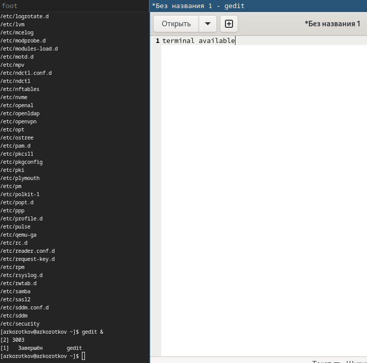
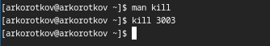

---
## Front matter
title: "Отчёт по лабораторной работе №6:"
subtitle: "Поиск файлов. Перенаправлениеввода-вывода. Просмотр запущенных процессов"
author: "Коротков Андрей Романович"

## Bibliography
bibliography: bib/cite.bib
csl: pandoc/csl/gost-r-7-0-5-2008-numeric.csl

## Pdf output format
toc: true # Table of contents
toc-depth: 2
lof: true # List of figures
fontsize: 12pt
linestretch: 1.5
papersize: a4
documentclass: scrreprt

## I18n polyglossia
polyglossia-lang:
  name: russian
  options:
	- spelling=modern
	- babelshorthands=true
polyglossia-otherlangs:
  name: english

## I18n babel
babel-lang: russian
babel-otherlangs: english

## Fonts
mainfont: PT Mono
romanfont: PT Mono
sansfont: PT Mono
monofont: PT Mono
mainfontoptions: Ligatures=TeX
romanfontoptions: Ligatures=TeX
sansfontoptions: Ligatures=TeX,Scale=MatchLowercase
monofontoptions: Scale=MatchLowercase,Scale=0.9

## Biblatex
biblatex: true
biblio-style: "gost-numeric"
biblatexoptions:
  - parentracker=true
  - backend=biber
  - hyperref=auto
  - language=auto
  - autolang=other*
  - citestyle=gost-numeric

## Pandoc-crossref LaTeX customization
figureTitle: "Рис."
listingTitle: "Листинг"
lofTitle: "Список иллюстраций"
lolTitle: "Листинги"

## Misc options
indent: true
header-includes:
  - \usepackage[russian]{babel}
  - \usepackage[utf8]{inputenc}
  - \usepackage{indentfirst}
  - \usepackage{float} # keep figures where there are in the text
  - \floatplacement{figure}{H} # keep figures where there are in the text
---

# Цель работы
Ознакомиться с инструментами поиска файлов и фильтрации текстовых данных. Приобретести практические навыки: по управлению процессами (и заданиями), по проверке использования диска и обслуживанию файловых систем.

# Задание
1. Осуществить вход в систему, используя соответствующее имя пользователя.
2. Записать в файл file.txt названия файлов, содержащихся в каталоге /etc. Дописать в этот же файл названия файлов, содержащихся в домашнем каталоге.
3. Вывести имена всех файлов из file.txt, имеющих расширение .conf, после чего записать их в новый текстовый файл conf.txt.
4. Определить, какие файлы в домашнем каталоге имеют имена, начинавшиеся с символа "c". Предложить несколько вариантов, как это сделать.
5. Вывести на экран (постранично) имена файлов из каталога /etc, начинающиеся с символа "h".
6. Запустить в фоновом режиме процесс, который будет записывать в файл ~/logfile файлы, имена которых начинаются с "log".
7. Удалить файл ~/logfile.
8. Запустить из консоли в фоновом режиме редактор gedit.
9. Определить идентификатор процесса gedit, используя команду ps, конвейер и фильтр grep. Указать ещё один способ определения идентификатора процесса?
10. Прочитать справку (man) команды kill, после чего использовать её для завершения процесса gedit.
11. Выполнить команды df и du, предварительно получив более подробную информацию об этих командах, с помощью команды man.
12. Воспользовавшись справкой команды find, вывести имена всех директорий, имеющихся в домашнем каталоге.

# Выполнение лабораторной работы

### Задание 1

{#fig:001 width=100%}

### Задание 2
Запишем в файл file.txt названия файлов, содержащихся в каталоге /etc командой **find /etc -maxdepth 1 -type f > file.txt** и запишем в этот же файл названия файлов, содержащихся в домашнем каталоге командой **find ~/ -maxdepth 1 -type f >> file.txt**

{#fig:002 width=100%}

### Задание 3
Выведем имена всех файлов из file.txt, имеющих расширение .conf, после чего запишем их в новый текстовый файл conf.txt командой **grep .conf file.txt > conf.txt**

{#fig:003 width=100%}

### Задание 4
Определим, какие файлы в домашнем каталоге имеют имена, начинавшиеся с символа "c" с помощью команды **find ~/ -maxdepth 1 -name c\*** или команды **ls | grep c\***

{#fig:004 width=100%}

### Задание 5
Выведем на экран (постранично) имена файлов из каталога /etc, начинающиеся с символа "h" командой **find /etc -maxdepth 1 -type f -name h* | more**

{#fig:005 width=100%}

### Задание 6
Запустим в фоновом режиме процесс, который будет записывать в файл ~/logfile файлы, имена которых начинаются с "log" командой **find -type f -name log* -print > logfile &**

{#fig:006 width=100%}

### Задание 7
Удалим файл ~/logfile командой **rm logfile**

{#fig:007 width=100%}

### Задание 8
Запустим из консоли в фоновом режиме редактор gedit командой **gedit &**

{#fig:008 width=100%}

### Задание 9
Определим идентификатор процесса gedit, используя команду ps, конвейер и фильтр grep введя команду **ps | grep gedit**. В качестве альтернативы можно ввести команду **jobs -l | grep gedit**

{#fig:009 width=100%}

### Задание 10
Прочитав справку (man) команды kill, используем её для завершения процесса gedit командой kill **номерПроцесса**

{#fig:0010 width=100%}

### Задание 11
Выполнить команды df и du, предварительно получив более подробную информацию об этих командах, с помощью команды man. Выполним команды **df -h** и **du --max-depth=1 -h**

{#fig:011 width=100%}

### Задание 12
Воспользовавшись справкой команды find, выведем имена всех директорий, имеющихся в домашнем каталоге командой **find ~/ -maxdepth 1 -type d**

{#fig:012 width=100%}

# Выводы
В ходе данной лабораторной работы я ознакомился с инструментами поиска файлов и фильтрации текстовых данных. Приобрёл практические навыки: по управлению процессами (и заданиями), по проверке использования диска и обслуживанию файловых систем.

# Ответы на контрольные вопросы
1.**stdin** — поток ввода (по умолчанию: клавиатура), файловый дескриптор 0;

**stdout** — поток вывода (по умолчанию: консоль), файловый дескриптор 1;

**stderr** — поток вывод сообщений об ошибках (по умолчанию: консоль), файловый дескриптор 2.

2.Операция ">" перезаписывает данные, а оперция ">>" дополняет.

3.Конвейер служит для объединения простых команд или утилит в цепочки, в которых результат работы предыдущей команды передаётся последующей.

4.Процесс - это экземпляр программы, который запущен в оперативной памяти компьютера. Он представляет собой динамическое исполнение программы, включающее код программы, данные, контекст выполнения и другие ресурсы, необходимые для ее выполнения. Программа - это алгоритм или набор инструкций на диске, в то время как процесс - это экземпляр программы, выполняющийся в оперативной памяти.

5.PID - это уникальный числовой идентификатор, который присваивается каждому запущенному процессу в операционной системе.

GID - это числовой идентификатор, который присваивается группе пользователей в операционной системе.

6.Задача или процесс представляет собой выполняющуюся программу или программный код в оперативной памяти компьютера. Каждая задача имеет свой уникальный идентификатор.
Команда **ps** позволяет получать информацию о текущей загрузке системы, ресурсах, используемых процессами, и выполнении конкретных программ.

7.**top** является интерактивной утилитой для мониторинга системных ресурсов и процессов в реальном времени. Она отображает список текущих процессов, использующих CPU и память, с возможностью сортировки по различным критериям.

**htop** является более продвинутой альтернативой top с графическим интерфейсом в текстовом режиме. Она предоставляет более детализированное представление процессов, включая их иерархическую структуру, использование CPU и памяти в процентах, а также возможность управления процессами непосредственно из интерфейса.

8.Команда **find** позволяет указать различные критерии поиска, такие как имя файла, тип файла, дата изменения, права доступа и другие атрибуты.
Пример:

- **find /var/log -type f -name "*.log"**
- **find ~ -name "*~" -exec rm "{}" \;**

9.Команда **find** используется для поиска файлов по различным критериям, а в сочетании с **grep** позволяет искать файлы на основе их содержимого. 
Пример:

**find . -type f -exec grep -l "pattern" {} +**

10.Команда **df -h** показывает общее использование и доступное пространство для каждой монтированной файловой системы.

11.С помощью команды **du ~/ -s -h**

12.С помощью команды **kill PID процесса**