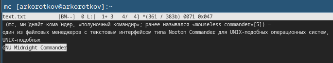
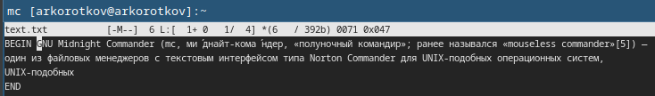

---
## Front matter
title: "Отчёт по лабораторной работе №7:"
subtitle: "Командная оболочка Midnight Commander"
author: "Коротков Андрей Романович"

## Bibliography
bibliography: bib/cite.bib
csl: pandoc/csl/gost-r-7-0-5-2008-numeric.csl

## Pdf output format
toc: true # Table of contents
toc-depth: 2
lof: true # List of figures
fontsize: 12pt
linestretch: 1.5
papersize: a4
documentclass: scrreprt

## I18n polyglossia
polyglossia-lang:
  name: russian
  options:
	- spelling=modern
	- babelshorthands=true
polyglossia-otherlangs:
  name: english

## I18n babel
babel-lang: russian
babel-otherlangs: english

## Fonts
mainfont: PT Mono
romanfont: PT Mono
sansfont: PT Mono
monofont: PT Mono
mainfontoptions: Ligatures=TeX
romanfontoptions: Ligatures=TeX
sansfontoptions: Ligatures=TeX,Scale=MatchLowercase
monofontoptions: Scale=MatchLowercase,Scale=0.9

## Biblatex
biblatex: true
biblio-style: "gost-numeric"
biblatexoptions:
  - parentracker=true
  - backend=biber
  - hyperref=auto
  - language=auto
  - autolang=other*
  - citestyle=gost-numeric

## Pandoc-crossref LaTeX customization
figureTitle: "Рис."
listingTitle: "Листинг"
lofTitle: "Список иллюстраций"
lolTitle: "Листинги"

## Misc options
indent: true
header-includes:
  - \usepackage[russian]{babel}
  - \usepackage[utf8]{inputenc}
  - \usepackage{indentfirst}
  - \usepackage{float} # keep figures where there are in the text
  - \floatplacement{figure}{H} # keep figures where there are in the text
---

# Цель работы
Освоить основные возможности командной оболочки Midnight Commander. Приобрести навыки практической работы по просмотру каталогов и файлов; манипуляций с ними.

# Задание

## Задание по mc
1. Изучить информацию о mc, вызвав в командной строке man mc.
2. Запустить из командной строки mc, изучите его структуру и меню.
3. Выполнить несколько операций в mc, используя управляющие клавиши (операции с панелями; выделение/отмена выделения файлов, копирование/перемещение файлов, получение информации о размере и правах доступа на файлы и/или каталоги и т.п.)
4. Выполнить основные команды меню левой (или правой) панели. Оценить степень подробности вывода информации о файлах.
5. Используя возможности подменю Файл, выполнить:
    1. просмотр содержимого текстового файла;
    2. редактирование содержимого текстового файла (без сохранения результатов редактирования);
    3. создание каталога;
    4. копирование файлов в созданный каталог.
6. С помощью соответствующих средств подменю Команда осуществить:
    1. поиск в файловой системе файла с заданными условиями (например, файла с расширением .c или .cpp, содержащего строку main);
    2. выбор и повторение одной из предыдущих команд;
    3. переход в домашний каталог;
    4. анализ файла меню и файла расширений.
7. Вызвать подменю Настройки. Освоить операции, определяющие структуру экрана mc (Full screen, Double Width, Show Hidden Files и т.д.)

## Задание по встроенному редактору mc
1. Создать текстовой файл text.txt.
2. Открыть этот файл с помощью встроенного в mc редактора.
3. Вставить в открытый файл небольшой фрагмент текста, скопированный из любого другого файла или Интернета.
4. Проделать с текстом следующие манипуляции, используя горячие клавиши:
    1. Удалить строку текста.
    2. Выделить фрагмент текста и скопировать его на новую строку.
    3. Выделить фрагмент текста и перенести его на новую строку.
    4. Сохранить файл.
    5. Отменить последнее действие.
    6. Перейти в конец файла (нажав комбинацию клавиш) и написать некоторый текст.
    7. Перейти в начало файла (нажав комбинацию клавиш) и написать некоторый текст.
    8. Сохранить и закрыть файл.
5. Открыть файл с исходным текстом на некотором языке программирования (например C или Java)
6. Используя меню редактора, включить подсветку синтаксиса, если она не включена, или выключить, если она включена.

# Выполнение лабораторной работы

## Задание по mc

### Задание 1
Вводим команду **man mc** , изучаем руководство.

{#fig:001 width=100%}

### Задание 2
Запускаем mc соответсвующей командой - изучаем его структуру и меню.

{#fig:002 width=100%}

### Задание 3
Переключение между панелями осуществляется нажатием клавиши *Tab*. В верхнем выпадающем меню можно выбрать режим отображения для панели.

{#fig:003 width=100%}

Выделение и отмена выделения файлов осуществляется через клавишу *Shift* или *пр.кнопку мыши*

{#fig:004 width=100%}

Копирование файлов осуществляется нажатием клавиши *F5*

{#fig:005 width=100%}

Перенос файлов осуществляется нажатием клавиши *F6*

{#fig:006 width=100%}

Для отображения информации о выбранном файле/каталоге необходимо переключить режим отображения для одной из панелей

{#fig:007 width=100%}

### Задание 4
Команды панелей позволяют получить сводную информацию по файлам, проводить сравнение файлов и каталогов. Например можно быстро просмотреть содержание файла наведя на него фокус.

{#fig:008 width=100%}

### Задание 5
Просмотр содержимого текстового файла посредством подменю Файл.

{#fig:009 width=100%}

Редактирование содержимого текстового файла посредством подменю Файл.

{#fig:010 width=100%}

Создание каталога посредством подменю Файл.

{#fig:011 width=100%}

Копирование файлов в созданный каталог посредством подменю Файл.

{#fig:012 width=100%}

### Задание 6
Поиск в файловой системе файла с заданными условиями: файл с расширением .c или .cpp, содержащего строку main посредством подменю Команда.

{#fig:013 width=100%}

Выбор и повторение одной из предыдущих команд посредством подменю Команда.

{#fig:014 width=100%}

Переход в домашний каталог посредством подменю Команда.

{#fig:015 width=100%}

Просмотр файла меню и файла расширений посредством подменю Команда.

{#fig:016 width=100%}

{#fig:017 width=100%}

### Задание 7
Вызвав подменю Настройки можно настроить положение панелей, оформление mc и отображение информации.

{#fig:018 width=100%}

## Задание по встроенному редактору mc

### Задание 1
Создадим текстовый файл text.txt .

{#fig:019 width=100%}

### Задание 2
Откроем файл text.txt с помощью редактора mc.

{#fig:020 width=100%}

### Задание 3
Вставим небольшой текст со страницы википедии в файл text.txt

{#fig:021 width=100%}

### Задание 4
Удалим строку текста использовав комбинацию клавиш *Ctrl+y*.

{#fig:022 width=100%}

Выделим фрагмент текста клавишей *F3* и скопируем нажатием клавиши *F5*.

{#fig:023 width=100%}

Выделим фрагмент текста и перенесём нажатием клавиши *F6*.

{#fig:024 width=100%}

Сохраним файл нажав клавишу *F2*.

{#fig:025 width=100%}

Отменим последнее действие нажатием комбинации клавиш *Ctrl+u*.

{#fig:026 width=100%}

Перейдём в конец файла комбинацией клавиш *Ctrl+End*.

{#fig:027 width=100%}

Перейдём в начало файла комбинацией клавиш *Ctrl+Home*.

{#fig:028 width=100%}

Сохраним и закроем файл нажав клавишу *F10*.

{#fig:029 width=100%}

### Задание 5
Откроем файл с исходным текстом на языке программирования C#.

{#fig:030 width=100%}

### Задание 6
Выключим подсветку синтаксиса комбицией клавищ *Ctrl+s*.

{#fig:031 width=100%}

# Выводы
В ходе данной лабораторной работы я освоил основные возможности командной оболочки Midnight Commander. Приобрёл навыки практической работы по просмотру каталогов и файлов; манипуляций с ними.

# Ответы на контрольные вопросы
**1.**Основные режимы работы в mc:

- Панельный режим - это основной режим работы mc, в котором отображаются две панели. Панели могут отображать информацию в различных форматах, таких как полное, краткое или детализированное представление файлов и директорий.
- Режим просмотра файлов - в этом режиме mc позволяет просматривать содержимое файлов. 
- Режим редактирования файлов - можно использовать для редактирования текстовых файлов.
- Режим командной строки - внизу экрана пользователь может вводить команды оболочки (shell).
- Режим работы с архивами - позволяет работать с архивами как с обычными директориями.

**2.****Копирование файлов**

Команда shell:
cp source_file destination_directory/

Меню/Клавиши в mc:

Выбрать файл и нажать F5, затем указать путь назначения и нажать Enter.

**Перемещение файлов**

Команда shell:
mv source_file destination_directory/

Меню/Клавиши в mc:

Выбрать файл и нажать F6, затем указать путь назначения и нажать Enter.

**Удаление файлов**

Команда shell:
rm file_name

Меню/Клавиши в mc:

Выберать файл и нажать F8, затем подтвердить удаление.

**Просмотр содержимого файла**

Команда shell:
cat file_name

Меню/Клавиши в mc:

Выбрать файл и нажать F3 для просмотра.

**Редактирование файла**

Команда shell:
nano file_name

Меню/Клавиши в mc:

Выбрать файл и нажать F4 для редактирования.

**Создание директории**

Команда shell:
mkdir directory_name

Меню/Клавиши в mc:

Нажать F7, затем ввести имя новой директории и нажать Enter.

**Поиск файлов**

Команда shell:
find /path -name "file_name"

Меню/Клавиши в mc:

Нажать F9 (меню), выбрать "Команды" -> "Найти файл", затем ввести критерии поиска.

**3.**Команды меню Панелей:

- Подпункт меню Быстрый просмотр позволяет выполнить быстрый просмотр содержимого панели.
- Подпункт меню Информация позволяет посмотреть информацию о файле или каталоге.

В меню каждой (левой или правой) панели можно выбрать Формат списка:

- стандартный — выводит список файлов и каталогов с указанием размера и времени правки;
- ускоренный — позволяет задать число столбцов, на которые разбивается панель при выводе списка имён файлов или каталогов без дополнительной информации;
- расширенный — помимо названия файла или каталога выводит сведения о правах доступа, владельце, группе, размере, времени правки;
- определённый пользователем — позволяет вывести те сведения о файле или каталоге, которые задаст сам пользователь.
- Подпункт меню Порядок сортировки позволяет задать критерии сортировки при выводе списка файлов и каталогов: без сортировки, по имени, расширенный, время правки, время доступа, время изменения атрибута, размер, узел.

**4.**В меню Файл содержит перечень команд, которые могут быть применены к одному или нескольким файлам или каталогам. Команды меню Файл:

- Просмотр — позволяет посмотреть содержимое текущего (или выделенного) файла без возможности редактирования.
- Просмотр вывода команды — функция запроса команды с параметрами (аргумент к текущему выбранному файлу).
- Правка — открывает текущий (или выделенный) файл для его редактирования.
- Копирование — осуществляет копирование одного или нескольких файлов или каталогов в указанное пользователем во всплывающем окне место.
- Права доступа — позволяет указать (изменить) права доступа к одному или нескольким файлам или каталогам.
- Жёсткая ссылка — позволяет создать жёсткую ссылку к текущему (или выделенному) файлу.
- Символическая ссылка — позволяет создать символическую ссылку к текущему (или выделенному) файлу.
- Владелец/группа — позволяет задать (изменить) владельца и имя группы для одного или нескольких файлов или каталогов.
- Права (расширенные) — позволяет изменить права доступа и владения для одного или нескольких файлов или каталогов.
- Переименование — позволяет переименовать (или переместить) один или несколько файлов или каталогов.
- Создание каталога — позволяет создать каталог.
- Удалить — позволяет удалить один или несколько файлов или каталогов.
- Выход — завершает работу mc.

**5.**В меню Команда содержатся более общие команды для работы с mc.
Команды меню Команда:

- Дерево каталогов — отображает структуру каталогов системы.
- Поиск файла — выполняет поиск файлов по заданным параметрам
- Переставить панели — меняет местами левую и правую панели.
- Сравнить каталоги — сравнивает содержимое двух каталогов.
- Размеры каталогов — отображает размер и время изменения каталога.
- История командной строки — выводит на экран список ранее выполненных в оболочке команд.
- Каталоги быстрого доступа — при вызове выполняется быстрая смена текущего каталога на один из заданного списка.
- Восстановление файлов — позволяет восстановить файлы на файловых системах ext2 и ext3.
- Редактировать файл расширений — позволяет задать с помощью определённого синтаксиса действия при запуске файлов с определённым расширением.
- Редактировать файл меню — позволяет отредактировать контекстное меню пользователя, вызываемое по клавише F2.
- Редактировать файл расцветки имён — позволяет подобрать оптимальную для пользователя расцветку имён файлов в зависимости от их типа.

**6.**Меню Настройки содержит ряд дополнительных опций по внешнему виду и функциональности mc.
Меню Настройки содержит:

- Конфигурация — позволяет скорректировать настройки работы с панелями.
- Внешний вид и Настройки панелей — определяет элементы (строка меню, командная строка, подсказки и прочее), отображаемые при вызове mc, а также геометрию расположения панелей и цветовыделение.
- Биты символов — задаёт формат обработки информации локальным терминалом.
- Подтверждение — позволяет установить или убрать вывод окна с запросом подтверждения действий при операциях удаления и перезаписи файлов, а также при выходе из программы.
- Распознание клавиш — диалоговое окно используется для тестирования функциональных клавиш, клавиш управления курсором и прочее.
- Виртуальные ФС — настройки виртуальной файловой системы: тайм-аут, пароль и прочее.

**7.**Основные встроенные команды mc и их краткая характеристика:

- view - Открывает выбранный файл для просмотра.
- edit - открывает выбранный файл для редактирования.
- copy - копирует выбранные файлы в указанное место.
- move - реремещает выбранные файлы в указанное место.
- delete - удаляет выбранные файлы.
- user menu - показывает пользовательское меню с часто используемыми командами.

**8.**Основные из команд редактора mc и их краткая характеристика:

- Save - сохраняет текущий файл.
- Exit - закрывает редактор, предложив сохранить изменения, если они не сохранены.
- Find - осуществляет поиск строки текста в текущем файле.
- Replace - заменяет строки текста в текущем файле.
- Goto - перемещает курсор к указанной строке в файле.
- Copy - копирует выделенный текст в буфер.
- Cut - вырезает выделенный текст в буфер.
- Paste - вставляет текст из буфера в текущую позицию курсора.
- Undo - отменяет последнее действие.
- Redo - повторяет последнее отменённое действие.
- Begin/End - перемещает курсор в начало или конец файла.

**9.**Пользовательское меню - позволяет добавлять часто используемые команды и скрипты для быстрого доступа.

Файл меню пользователя(~/.config/mc/menu или ~/.mc/menu) - содержит определения пунктов меню. В этом файле можно указать команды, которые будут выполняться при выборе соответствующих пунктов меню.

Переменные и макросы - в пользовательском меню можно использовать переменные и макросы, такие как %f (имя текущего файла), %d (текущая директория) и другие, чтобы команды были более гибкими и контекстуальными.

**10.**Команды mc для текущего файла:

- Просмотр файла: F3 - Открывает текущий файл в режиме просмотра.
- Редактирование файла: F4 - Открывает текущий файл в редакторе.
- Копирование файла: F5 - Копирует текущий файл.
- Перемещение файла: F6 - Перемещает текущий файл.
- Удаление файла: F8 - Удаляет текущий файл.