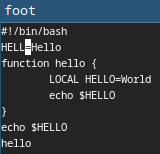
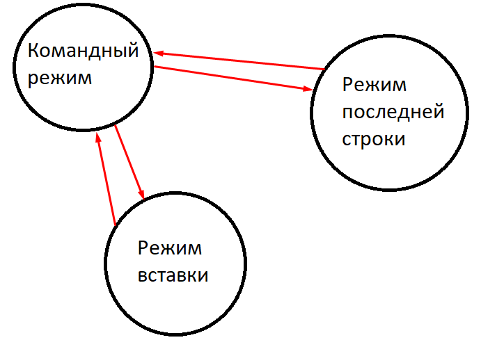

---
## Front matter
title: "Отчёт по лабораторной работе №8:"
subtitle: "Текстовой редактор vi"
author: "Коротков Андрей Романович"

## Bibliography
bibliography: bib/cite.bib
csl: pandoc/csl/gost-r-7-0-5-2008-numeric.csl

## Pdf output format
toc: true # Table of contents
toc-depth: 2
lof: true # List of figures
fontsize: 12pt
linestretch: 1.5
papersize: a4
documentclass: scrreprt

## I18n polyglossia
polyglossia-lang:
  name: russian
  options:
	- spelling=modern
	- babelshorthands=true
polyglossia-otherlangs:
  name: english

## I18n babel
babel-lang: russian
babel-otherlangs: english

## Fonts
mainfont: PT Mono
romanfont: PT Mono
sansfont: PT Mono
monofont: PT Mono
mainfontoptions: Ligatures=TeX
romanfontoptions: Ligatures=TeX
sansfontoptions: Ligatures=TeX,Scale=MatchLowercase
monofontoptions: Scale=MatchLowercase,Scale=0.9

## Biblatex
biblatex: true
biblio-style: "gost-numeric"
biblatexoptions:
  - parentracker=true
  - backend=biber
  - hyperref=auto
  - language=auto
  - autolang=other*
  - citestyle=gost-numeric

## Pandoc-crossref LaTeX customization
figureTitle: "Рис."
listingTitle: "Листинг"
lofTitle: "Список иллюстраций"
lolTitle: "Листинги"

## Misc options
indent: true
header-includes:
  - \usepackage[russian]{babel}
  - \usepackage[utf8]{inputenc}
  - \usepackage{indentfirst}
  - \usepackage{float} # keep figures where there are in the text
  - \floatplacement{figure}{H} # keep figures where there are in the text
---

# Цель работы
Познакомиться с операционной системой Linux. Получить практические навыки работы с редактором vi, установленным по умолчанию практически во всех дистрибутивах.

# Задание

1. Создание нового файла с использованием vi:
    1. Создать каталог с именем ~/work/os/lab06.
    2. Перейти в созданный каталог.
    3. Вызвать vi и создать файл hello.sh
    4. Нажать клавишу *i* и ввести следующий текст:
    ```
    #!/bin/bash
    HELL=Hello
    function hello {
    LOCAL HELLO=World
    echo $HELLO
    }
    echo $HELLO
    hello
    ```
    5. Нажать клавишу *Esc* для перехода в командный режим после завершения ввода текста.
    6. Нажать *:* для перехода в режим последней строки, ввести *w* (записать) и *q* (выйти), а затем нажать клавишу *Enter* для сохранения текста и завершения работы.
    7. Сделать файл исполняемым.

2. Редактирование существующего файла:
    1. Вызвать vi на редактирование файла.
    2. Установить курсор в конец слова **HELL** второй строки.
    3. Перейти в режим вставки и заменить **HELL** на **HELLO**. Нажать *Esc* для возврата в командный режим.
    4. Установить курсор на четвертую строку и стереть слово **LOCAL**.
    5. Перейти в режим вставки и набрать **local**, нажать Esc для возврата в командный режим.
    6. Установить курсор на последней строке файла. Вставить после неё строку **echo $HELLO** и нажать *Esc* для перехода в командный режим.
    7. Удалить последнюю строку.
    8. Ввести команду отмены изменений *u* для отмены последней команды.
    9. Ввести символ *:* для перехода в режим последней строки. Записать произведённые изменения и выйти из vi.


# Выполнение лабораторной работы

## Задание 1
Создадим каталог ~/work/os/lab06.

{#fig:001 width=100%}


Переходим в созданный каталог.

{#fig:002 width=100%}


Вызываем vi и создаём файл командой **vi hello.sh**

{#fig:003 width=100%}


Нажмём *i* и вводим необходимый текст.

{#fig:004 width=100%}


После ввода текста нажимаем клавишу *Esc* для перехода в командный режим.

{#fig:005 width=100%}


Вводим символ *:* для перехода в режим последней строки, затем вводим *w* (записать) и *q* (выйти). Подтверждаем нажатием клавиши *Enter* для сохранения текста и завершения работы.

{#fig:006 width=100%}


Делаем файл исполняемым командой **chmod +x hello.sh**

{#fig:007 width=100%}


## Задание 2
Вызываем vi для редактирования файла командой **vi hello.sh**

{#fig:008 width=100%}

Установим курсор в конец слова **HELL** второй строки. Для удобства будем использовать *w* и *b* перемещающие вперёд и назад соответственно, на одно слово.

{#fig:009 width=100%}


Переходим в режим вставки и заменяем **HELL** на **HELLO**. Нажимаем *Esc* для возврата в командный режим.

{#fig:010 width=100%}


Установим курсор на четвертую строку и стераем слово **LOCAL** последовательностью *d* *w*.

{#fig:011 width=100%}


Переходим в режим вставки и набираем **local**, нажать *Esc* для возврата в командный режим.

{#fig:012 width=100%}


Установим курсор на последней строке файла. Вставляем после неё строку **echo $HELLO** и нажимаем *Esc* для перехода в командный режим.

{#fig:013 width=100%}


Удалим последнюю строку последовательностью *d* *d*.

{#fig:014 width=100%}


Введём *u* для отмены последней команды.

{#fig:015 width=100%}


Введём символ *:* для перехода в режим последней строки. Запишем произведённые изменения командой *w* и выйдем из vi командой *q*. Запустим полученный файл для проверки командой **sh hello.sh**

{#fig:016 width=100%}


# Выводы
В ходе данной лабораторной работы я познакомился с операционной системой Linux. Получил практические навыки работы с редактором vi, установленным по умолчанию практически во всех дистрибутивах.

# Ответы на контрольные вопросы
**1.**Редактор vi имеет три режима работы:

- командный режим — предназначен для ввода команд редактирования и навигации по редактируемому файлу;
- режим вставки — предназначен для ввода содержания редактируемого файла;
- режим последней (или командной) строки — используется для записи изменений в файл и выхода из редактора.


**2.**Последовательность команд **:**, **q!**.


**3.**Команды позиционирования:

- 0 (ноль) — переход в начало строки;
- $ — переход в конец строки;
- G — переход в конец файла;
- n G — переход на строку с номером n.


**4.**В редакторе vi слово определяется как последовательность символов, ограниченная пробелами, знаками пунктуации или другими неалфавитно-цифровыми символами.


**5.**Для перехода в конец файла – *G* , для перехода в начало – *1G*


**6.**Команды редактирования:

- Вставка текста - вставляет текст в строку в зависимости от позиции курсора
- Вставка строки - вставляет текст над или под курсором
- Удаление текста - удаляет текст и целые строки
- Отмена и повтор произведённых изменений - отменяет и повторяет действия
- Копирование текста в буфер - копирует строки и слова
- Вставка текста из буфера - вставляет текст в зависимости от позиции курсора
- Замена текста - заменяет текст в зависимости от позиции курсора
- Поиск текста - производит поиск по тексту в зависимости от указанной строки


**7.**Установлю курсор на желаемую строку. Введу команду **числоСимволов i**, введу символ *$* и нажму *Esc*. Результатом будет строка заполненная указанным числом символов.


**8.**Ввести команду *u*.


**9.**Команды редактирования в режиме командной строки
- Копирование и перемещение текста - удаляет, перемещает, копирует строки. Записывает строки в файл.
- Запись в файл и выход из редактора - сохраняет текст в файл, закрывает vi.


**10.**Ввести команду *$* для перехода в конец строки.


**11.**Опции редактора vi позволяют настроить рабочую среду. Для задания опций используется команда set (в режиме последней строки):

- **: set all** — вывести полный список опций;


Узнать назначение можно по названию опции или воспользовавшись руководством.


**12.**В командном режиме нажатие клавиш выполняет команды редактирования, перемещения и управления текстом, а не вводит текст.


В режиме вставки текст вводится непосредственно в документ. Внизу есть надпись *INSERT*.


В режиме последней строки вводятся команды для выполнения действий, таких как сохранение или выход. Внизу отображается символ *:*.


**13.**Граф взаимосвязи режимов:

{#fig:017 width=100%}